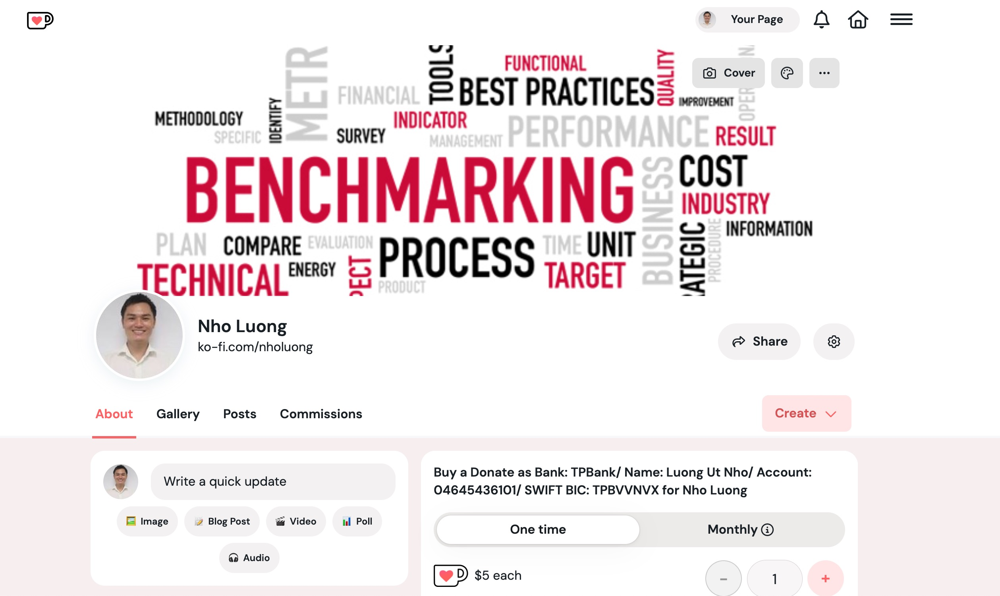

# Metrics

### [View all Roadmaps](https://github.com/nholuongut/all-roadmaps) &nbsp;&middot;&nbsp; [Best Practices](https://github.com/nholuongut/all-roadmaps/blob/main/public/best-practices/) &nbsp;&middot;&nbsp; [Questions](https://www.linkedin.com/in/nholuong/)
 

Kubernetes metrics API type definitions and clients.

## Purpose

This repository contains type definitions and client code for the metrics
APIs that Kubernetes makes use of.  Depending on the API, the actual
implementations live elsewhere.

Consumers of the metrics APIs can make use of this repository to access
implementations of the APIs, while implementors should make use of this
library when implementing their API servers.

## APIs

This repository contains types and clients for several APIs.

### Custom Metrics API

This API allows consumers to access arbitrary metrics which describe
Kubernetes resources.

The API is intended to be implemented by monitoring pipeline vendors, on
top of their metrics storage solutions.

If you want to implement this as an API server for this API, please see the
[kubernetes-sigs/custom-metrics-apiserver](https://github.com/kubernetes-sigs/custom-metrics-apiserver)
library, which contains the basic infrastructure required to set up such
an API server.

Import Path: `k8s.io/metrics/pkg/apis/custom_metrics`.

### Resource Metrics API

This API allows consumers to access resource metrics (CPU and memory) for
pods and nodes.

The API is implemented by [metrics-server](https://github.com/nholuongut//metrics-server) and [prometheus-adapter](https://github.com/nholuongut//prometheus-adapter).

Import Path: `k8s.io/metrics/pkg/apis/metrics`.

## Compatibility

The APIs in this repository follow the standard guarantees for Kubernetes
APIs, and will follow Kubernetes releases.

Participation in the Kubernetes community is governed by the [Kubernetes
Code of Conduct](code-of-conduct.md).

### Contibution Guidelines

See [CONTRIBUTING.md](CONTRIBUTING.md) for more information.

# 🚀 I'm are always open to your feedback.  Please contact as bellow information:
### [Contact ]
* [Name: Nho Luong]
* [Skype](luongutnho_skype)
* [Github](https://github.com/nholuongut/)
* [Linkedin](https://www.linkedin.com/in/nholuong/)
* [Email Address](luongutnho@hotmail.com)
* [PayPal.me](https://www.paypal.com/paypalme/nholuongut)

# License
* Nho Luong (c). All Rights Reserved.🌟
